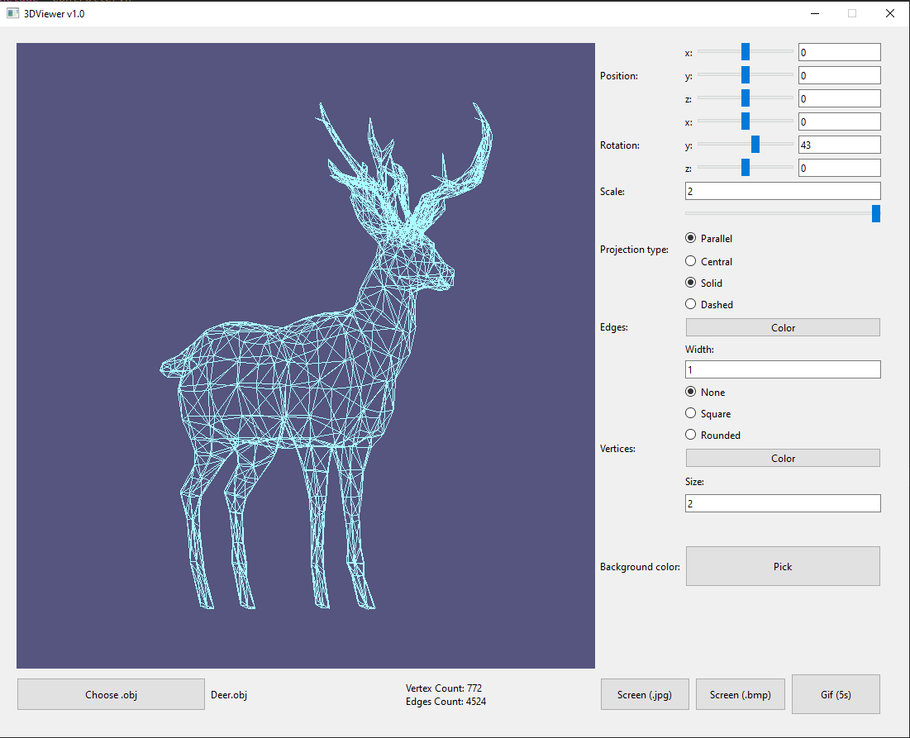
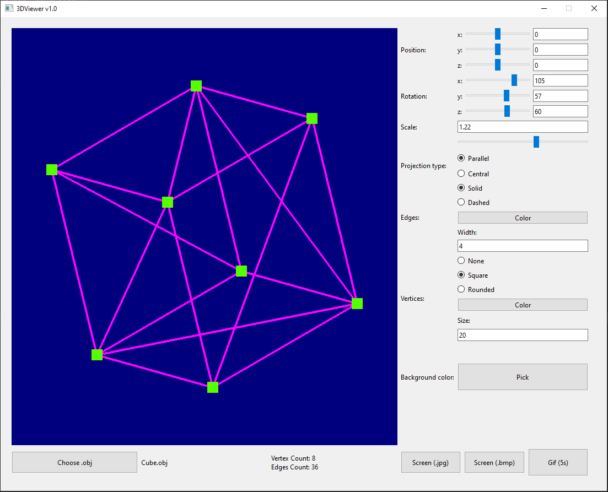

# CPP_3DViewer
👁️‍🗨️ A program for viewing 3D models of the format .obj

```Model rendering is implemented in OpenGL. Rotation/moving/scaling of the model is implemented on C++ using affine transformations.```

## Install:
1. Go to /src
2. Do ```make install```
3. Run from Desktop icon (or run executable ${PWD}/s21_3d_viewer/3DViewer.app)

## Overview:




